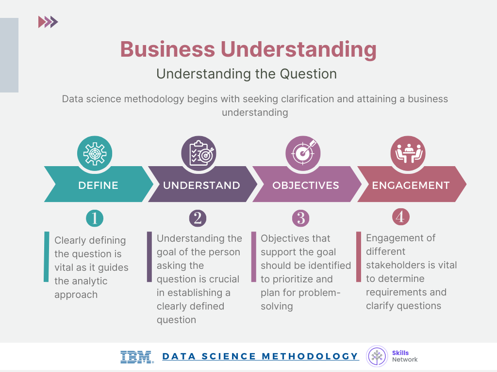
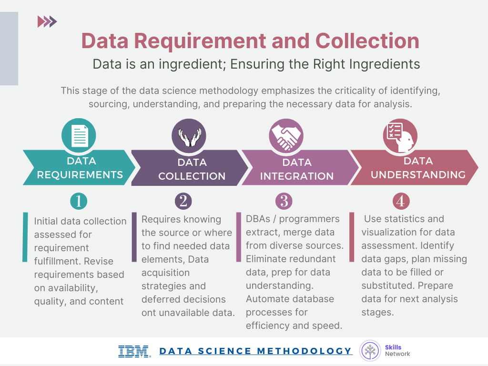

# IBM DS Specialization: Course 3

## Contents

* Overview
* Stages of DS Methodology:
    * Business Understanding
    * Analytic Approach
    * Data Requirements
    * Data Collection
    * Data Understanding
    * Data Preparation
    * Modeling
    * Evaluation
    * Deployment
    * Feedback
* Storytelling

## Overview

* The Data Science Methodology aims to answer 10 following questions:

1. Buisness Understanding: What is the problem that you're trying to solve?
2. Analytic Approach: How can you use data to answer the question?
3. Data Requirements: What data do you need to answer the question?
4. Data Collection: Where is the data coming from (identify all sources) and how will you get it?
5. Data Understanding: Is the data that you collected representative of the problem to be solved?
6. Data Preparation: What additional work is required to manipulate and work with the data?
7. Modeling: In what wat can the data be visualized to get to the answer that is required?
8. Evaluation: Does the model used really answer the initial question or does it need to be adjusted?
9. Deployment: Can you put the model into practice?
10. Feedback: Can you get constructive feedback into answering the question? 

* Data Science Methodology Flowchart:

# The 10 stages of Data Science Methodology:

1. **Business Understanding**: This is the beginning stage of the methodology because getting clarity around the problem to be solved allows you to determine which data will be used to answer the core question.
  

2. **Analytic Approach**: This entails identifying what type of patterns will be needed to address the question most effectively.

 
 
eg. A Predictive Model (Decision Tree Classification): Decision tree classification is a predictive analytics approach that's easy for non-data scientists to implement.

3. **Data Requirements**: Prior to undertaking the data collection and data preparation stages of the methodology, it's vital to define the data requirements for decision-tree classification. This includes identifying the necessary data content, formats and sources for initial data collection. 

4. **Data Collection**: 
* In this stage, the data scientist will have a good understanding of what they will be working with. 
* Techniques such as descriptive statistics and visualization can be applied to the data set, to assess the content, quality, and initial insights about the data. Gaps in data will be identified and plans to either fill or make substitutions will have to be made. 
* DBAs and programmers often work together to extract data from various sources, and then merge it. Redundant data can be removed.
* At this stage, if necessary, data scientists and analytics team members can discuss various ways to better manage their data, including automating certain processes in the database, so that data collection is easier and faster.
* When collecting data, it is alright to defer decisions about unavailable data, and attempt to acquire it at a later stage.

5. **Data Understanding**:
* The Data Understanding stage encompasses all activities related to constructing the data set and answers the question as to whether the data you collected represents the problem to be solved.
* During the Data Understanding stage, scientists might use descriptive statistics, predictive statistics, or both.
* Data scientists commonly apply Hurst, univariates, and other statistics on each variable, such as mean, median, minimum, maximum, standard deviation, pairwise correlation, and histograms. Data scientists also use univariates, statistics, and histograms to assess data quality.
* The univariates, statistics, and histograms are used to assess data quality. From the information provided, certain values can be re-coded or perhaps even dropped if necessary, such as when a certain variable has missing values. 
* The more one works with the problem and the data, the more one learns and therefore the more refinement that can be done within the model, ultimately leading to a better solution to the problem. 

6. **Data Preparation**:  
* The data preparation stage is concerned with getting rid of unwanted elements.
* Together with data collection and data understanding, data preparation is the most time-consuming phase of a data science project, typically taking 70% and even up to even 90% of the overall project time. Automating some of the data collection and preparation processes in the database, can reduce this time to as little as 50%. This time saving translates into increased time for data scientists to focus on creating models. 
* It works on getting the data into a state where it may be easier to work with. To work effectively with the data, it must be prepared in a way that addresses missing or invalid values and removes duplicates, toward ensuring that everything is properly formatted. 
* Feature engineering is also part of data preparation. It is the process of using domain knowledge of the data to create features that make the machine learning algorithms work. 
    * A feature is a characteristic that might help when solving a problem. 
    * Features within the data are important to predictive models and will influence the results you want to achieve. 
    * Feature engineering is critical when machine learning tools are being applied to analyze the data. 
* When working with text, text analysis steps for coding the data are required to be able to manipulate the data. The data scientist needs to know what they're looking for within their dataset to address the question. The text analysis is critical to ensure that the proper groupings are set, and that the programming is not overlooking what is hidden within. 
* While this entire phase may take a while to accomplish, if done right the results will support the project. If this is skipped over, then the outcome will not be up to par and may have you back at the drawing board. It is vital to take your time in this area, and use the tools available to automate common steps to accelerate data preparation. 

7. **Modeling**: 
* In this stage of the data science methodology, data scientists develop models, either descriptive or predictive, to answer specific questions. 
* Data Modelling focuses on developing models that are either descriptive or predictive. An example of a descriptive model might examine things like: if a person did this, then they're likely to prefer that. A predictive model tries to yield yes/no, or stop/go type outcomes. These models are based on the analytic approach that was taken, either statistically driven or machine learning driven.
* In the case of predictive modelling, the data scientist will use a training set. A training set is a set of historical data in which the outcomes are already known. The training set acts like a gauge to determine if the model needs to be calibrated. In this stage, the data scientist will play around with different algorithms to ensure that the variables in play are actually required. 
* The framework for descriptive Data Science Methodology is geared to do 3 things: First, understand the question at hand. Second, select an analytic approach or method to solve the problem, and third, obtain, understand, prepare, and model the data. The end goal is to move the data scientist to a point where a data model can be built to answer the question.
* A lot more work goes into the modeling, including iterating back to the data preparation stage to redefine some of the other variables, so as to better represent the underlying information, and thereby improve the model.

8. **Evaluation**:
* A model evaluation goes hand-in-hand with model building as such, the modeling and evaluation stages are done iteratively.
* Evaluation allows the quality of the model to be assessed but it's also an opportunity to see if it meets the initial request. 
* Evaluation answers the question: Does the model used really answer the initial question or does it need to be adjusted? 
* Model evaluation can have two main phases:
    * *Diagnostic Measures Phase*: It is used to ensure the model is working as intended. If the model is a predictive model, a decision tree can be used to evaluate if the answer the model can output, is aligned to the initial design. It can be used to see where there are areas that require adjustments. If the model is a descriptive model, one in which relationships are being assessed, then a testing set with known outcomes can be applied, and the model can be refined as needed. 
    * *Statistical Significance Testing*: This type of evaluation can be applied to the model to ensure that the data is being properly handled and interpreted within the model. This is designed to avoid unnecessary second guessing when the answer is revealed. 
* ROC (Receiver Operating Characteristic) curve: 
    * It is commonly used in machine learning and data mining nowadays.
    * The ROC curve is a useful diagnostic tool in determining the optimal classification model. This curve quantifies how well a binary classification model performs, declassifying the yes and no outcomes when some discrimination criterion is varied.
    
9. **Deployment**: 
* During the Deployment stage, data scientists release the data model to a targeted group of stakeholders.
* While a data science model will provide an answer, the key to making the answer relevant and useful to address the initial question, involves getting the stakeholders familiar with the tool produced. In a business scenario, stakeholders have different specialties that will help make this happen, such as the solution owner, marketing, application developers, and IT administration. 
* Once the model is evaluated and the data scientist is confident it will work, it is deployed and put to the ultimate test. Depending on the purpose of the model, it may be rolled out to a limited group of users or in a test environment, to build up confidence in applying the outcome for use across the board. 

    

10. **Feedback**: 
* Once in play, feedback from the users will help to refine the model and assess it for performance and impact. The value of the model will be dependent on successfully incorporating feedback and making adjustments for as long as the solution is required. 
    
# **Storytelling**

 The role of storytelling in a data analyst's life cannot be overstated. It's super critical to get really good at storytelling with data. I think humans naturally understand the world through stories. If you're trying to convince anyone to do anything with data, the first thing you have to do is tell a clear, a concise, compelling story. It doesn't matter how much or what wonderful information you've come up with. If you can't find a way to communicate that to your audience, whether it's the consumer or a director level or executive level person, then it's for naught. You have to find a way to communicate that and it's usually best to do it in a visual or through telling a story, so that they understand how that information can be useful. 

